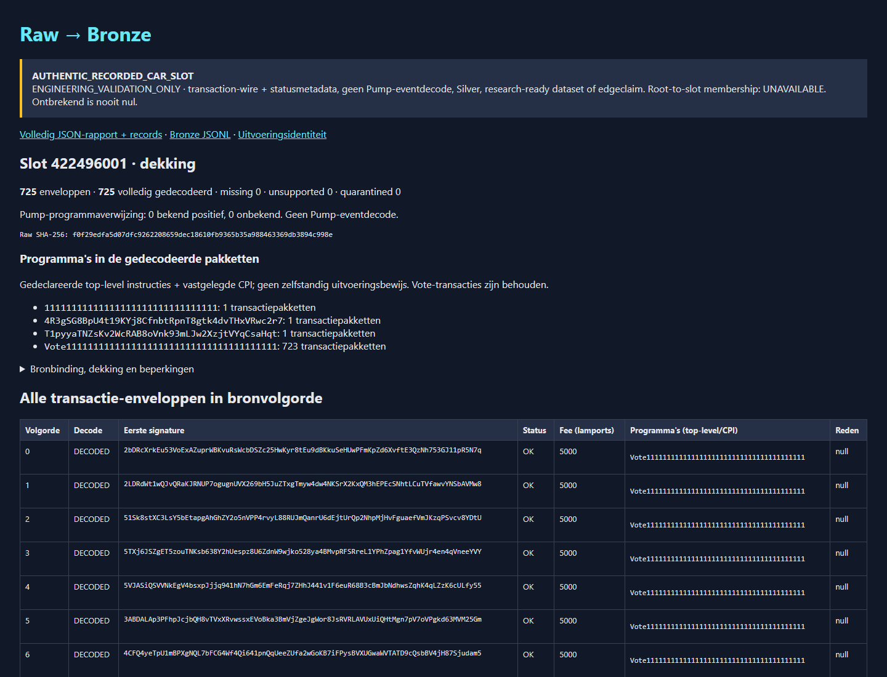

# B5 bounded authentic Raw → Bronze JSON

> **Document status: ACTIVE — bounded offline implementation, not B5 completion.**
> B4/#83 remains open / In Progress / ACTIVE NOW / Unproven. B5/#84 remains
> Backlog / NEXT / Unproven. The explicit development GO permits this partial
> B5 delivery while B4 is open; it grants no acquisition or evidence promotion.

## Actual input and result

The preserved run `of1-e978-metadata-09379cff-04` contains a separately approved
605,402-byte response for epoch 978, slot `422496001`, CAR bytes
`[45110,650512)`. Raw SHA-256:
`f0f29edfa5d07dfc9262208659dec18610fb9365b35a988463369db3894c998e`.
It is an `ENGINEERING_VALIDATION_ONLY` selection, not an outcome-independent
sample. Range size did not establish transaction or Pump presence beforehand.

The retained socket-denied reader independently reproduced 846 CID-verified nodes,
845 links, 725 Transaction, 119 Entry, one Rewards and one Block node, with zero
continuation DataFrame nodes. The new decoder's first complete offline execution
decoded **725/725 atomic transaction/status packages**, all legacy wire format,
all status `OK`, with no missing, unsupported or quarantined package in this slot.
723 packages reference the Vote program; the other two are retained too. No
Pump-program reference was observed. This is not Pump event decoding or an edge
result. Signatures are decoded, not cryptographically verified by this reader.

The first actual signature is
`2bDRcXrkEu53VoExAZuprWBKvuRsWcbDSZc25HwKyr8tEu9dBKkuSeHUwPFmKpZd6XvftE3QzNh753GJ11pR5N7q`;
its fee is the decoded integer `5000` lamports. The complete JSON/HTML report
contains every package, source offsets, signatures, fee/balance integers, status,
declared top-level programs and recorded inner CPI. Program references alone do
not prove invocation, an executed Pump event, coin launch or executable economics.



Execution artifacts and final identities are recorded in
[`B5_AUTHENTIC_RAW_BRONZE_RESULT.json`](B5_AUTHENTIC_RAW_BRONZE_RESULT.json).
The full reports, run inventory and standalone decoder executable remain outside
Git in `/home/dmesdary/solana-quant-data/governance/b5-authentic-decode-20260911`.
Three small exact authentic sections are retained as labelled regression vectors;
synthetic mutations and receipt/graph harnesses remain **Fixture** evidence.

The frozen release source is `c29b9d12cbf4b088d2f305ee0af970ab0b0c2d33`;
its executable SHA-256 is
`3608c21b795c0efc094fd9013c3ee61d5f15c28bdcbfac5072af59d79bc45f63`.
Two socket-denied release executions produced byte-identical JSON, JSONL and HTML.
The first measured 0.18 seconds wall time and 44,748 KiB peak resident memory;
this is a local offline decode measurement, not acquisition throughput or a
general full-epoch scaling claim. All 218 original run files and the preserved
acquisition executable matched their pre-execution hashes.

## Small source-bound path

[`rust/of1-bronze-decoder`](../../rust/of1-bronze-decoder/Cargo.toml) is a separate
offline crate. It links the existing recorder **without any optional feature**,
reuses `verify_recorded` and the signed-Shredding-corrected CAR verifier, and does
not change the recorder source, lockfile, old executable, manifests or leases.
The original 45,051-byte transaction-empty range and its historical failure
remain separate, unchanged evidence.

1. Validate historical run/plan/attempt/header/receipt/Raw bindings read-only.
2. Recheck the complete selected CAR/CID/slot/link graph with existing limits.
3. Follow Block → Entry → Transaction links in source order, retaining physical
   section positions separately. No physical-position guess or vote filtering.
4. Reassemble paired data/status DataFrames using the pinned next-list order;
   verify declared CRC64 GO-ISO, or the source's legacy FNV-1a64 fallback, over
   the assembled bytes **before** decompression. No declared checksum means
   `NOT_PRESENT_CID_VERIFIED`, not a claimed checksum success.
5. Decode Solana legacy/v0 wire with exact locked official Rust types and complete
   input consumption. Validate message/signature/index shapes. Decode bounded zstd
   status bytes into the source-bound protobuf projection; decode error enums
   with the official locked error type. No empty-metadata success default.
6. Publish one ordered Bronze JSON record per envelope, plus JSONL and a standalone
   quality report. A malformed package is MISSING, UNSUPPORTED or QUARANTINED;
   structural CAR/receipt/order/input-bound failure or aggregate-budget exhaustion
   stops output publication. Per-package assembly/decompression limits quarantine
   that package rather than hiding it or discarding the report.

Official source receipts, URLs and hashes are in
[`sources.json`](../../rust/of1-bronze-decoder/sources.json):

- Jetstreamer `cffaf3d891b3cbe45a46dd963d6d3571b2aa1a24`: archival nodes,
  DataFrame assembly, CRC/FNV and modern status codec selection; MIT/Apache-2.0.
- Agave `6c1ba34691f17ac902ae3d2e1147eed5723b9cef` (`v3.1.12`):
  `storage-proto/proto/confirmed_block.proto` and status conversion semantics;
  Apache-2.0. The small prost projection is **hand-declared**, not claimed generated.
- `solana-transaction = 3.0.2`, `solana-message = 3.0.1`,
  `solana-transaction-error = 3.2.0`: serde only; no signer/RPC feature.

The CLI is deliberately restricted to the epoch-978 modern protobuf lane and at
most three complete native published slot ranges; the [multi-slot increment](B5_MULTISLOT_PUMP_SEARCH.md)
retains the per-slot gates and adds selection budgets. Historical bincode status codecs, missing linked
frames, branching continuation layouts and future transaction/error variants are
not silently generalized. V0/address lookup resolution has synthetic tests; this
particular authentic slot proves only legacy-format observations.

## Meaning and provenance

Each record binds the run, original acquisition executable, manifests, plan and
receipt hashes, Raw hash, node CID and byte span, source transaction index and
derived Entry/transaction order. Original wire, stored status and decompressed
protobuf bytes are retained as hex. Raw remains the archive for all CAR nodes.

`acquired_at_unix_ms` is the actual receipt wall clock; `processed_at_unix_ms` is
the separate decoder execution clock. Both are operational provenance, not PIT
features. `effective_at` is chain order. Observation/actionability/execution times
remain null: no observation model or executable opportunity is fabricated.

Fees, balances, compute/cost units are decimal strings preserving exact u64 values.
Protobuf's protocol-defined scalar default is not an invented historical reading:
zero and absence of an implicit proto3 scalar encode the same value. Optional
fields retain absence. Empty status bytes never become default successful status.
Token balances, rewards, return data and unknown protobuf fields remain explicitly
unprojected, with original bytes preserved. No floating-point token amount is used
as a canonical economic quantity.

Missing CPI metadata makes Pump involvement unknown unless an actual program
reference already proves involvement. Unknown/quarantined packages remain visible
in the aggregate; the report does not turn them into a complete zero count.
Names, tickers, mint/decimal economic identity and launch dates are not inferred.
There is no Silver, physical Parquet-writer decision or lifecycle output here.

## Bounds, publication and checks

Offline reader bounds are 16 MiB total selected CAR, 4,096 nodes and 16,384 links per slot, 2 MiB per
assembled frame/decompressed status, an 8 MiB zstd window, and 16 MiB each for
per-slot decompressed metadata and serialized records, plus explicit 48 MiB
selection budgets for each across at most three slots. These are local decoder
resource limits, **not acquisition-cap increases**. Outer input/graph bounds and
aggregate-budget exhaustion stop publication. An individual package exceeding its
assembly or decompression bound is `QUARANTINED`; the report may still publish,
explicitly counting that envelope as not decoded. Root-to-slot membership remains
`UNAVAILABLE`.

Output is a **new directory outside the original run**. Files are create-new and
fsynced; artifact directory entries precede the `COMPLETE` marker, then the marker,
directory and parent are synced. No resume or overwrite is offered. A crash may
leave an incomplete output directory; readers must require the marker and verify
artifact hashes, not trust directory existence. This is not physical power-loss
testing or a distributed publication claim.

[`dependency-review.json`](../../rust/of1-bronze-decoder/dependency-review.json)
records the exact locked graph, licenses, enabled features and build-script hashes.
Zstd compiles bundled C with the already installed compiler. No system package,
Clang, CMake, protobuf compiler, database, signer or transport client is added.
The new gate checks graph drift and executes fmt, clippy, all tests and builds
under the existing socket-denial launcher. The separate CI steps add no authority
to the trusted-main Roadmap Sync.

```bash
cd /home/dmesdary/code/Solana-Quant-Bot
TOOLCHAIN_RUN=/home/dmesdary/.local/share/solana-quant/run-with-toolchain
"$TOOLCHAIN_RUN" node scripts/assert-of1-bronze-offline.mjs --all
"$TOOLCHAIN_RUN" cargo build --locked --offline --release \
  --manifest-path rust/of1-bronze-decoder/Cargo.toml
# Choose a NEW output directory with an existing parent; never the preserved run.
rust/of1-bronze-decoder/target/release/of1-bronze-decoder \
  /home/dmesdary/solana-quant-data/runs/of1-e978-metadata-09379cff-04 \
  /home/dmesdary/solana-quant-data/governance/b5-bronze-review-new
```

Open `quality.html` directly, or serve that one output directory on loopback with
the existing Python standard library (serving files is not Python domain decoding):

```bash
python3 -m http.server 4174 --bind 127.0.0.1 \
  --directory /home/dmesdary/solana-quant-data/governance/b5-authentic-decode-20260911/final
```

Windows browser: **http://localhost:4174/quality.html**.
The existing acquisition monitor at **http://localhost:4173/** separately shows
the attached 846-node/845-link archival verification. Its retained verifier says
domain decoding `NOT_PERFORMED`; the independent Bronze report supplies the new
domain result. No old report is rewritten to make the old verifier a B5 decoder.

## B4 / issue 83 acceptance matrix — no automatic closeout

| Requirement | Actual named evidence | Remaining boundary |
|---|---|---|
| Official fixed-host bounded metadata + payload | Preserved run: four metadata publications plus HTTP 206, 605,402 payload bytes; original receipts and plan hashes | No new range/run permission; expired leases remain expired |
| Raw/receipt durability and provenance | Original 218-file inventory, read-only pre/post comparison; verified hashes and range binding | No authentic power-loss/retry experiment claimed; crash/retry behavior has separate sealed fixtures |
| CAR/CID/selected-slot integrity | 846 nodes, 845 links; 725 Transaction / 119 Entry / 1 Block / 1 Rewards | Root-to-slot membership and whole-epoch CAR hash remain unavailable, as the bounded contract permits |
| Visible acquisition status | Existing monitor imports the exact run and attached verification; actual acquisition receipts remain separate from live simulation | Recorded import cannot reconstruct intra-request throughput that was not retained |
| Budget/request/deadline gates | Five actual attempts, zero retries; 5,789,563 published bytes and 5,797,594 reserved entity bytes in this run | Full-budget throughput/source-drift behavior is not proven by one small successful run |
| Engineering outcome and approval | Authentic transaction-bearing Raw is available; this development run confirms 725 wire/status decodes | B4 acceptance needs explicit review/GO. B5 decoder/coin/Silver gaps are not downloader failures |

No issue state, Project metadata, existing evidence class, budget or lease changes
are made by this delivery. Engineering insufficiency for Pump analysis is not
edge falsification. B4 and B5 remain open.

## PR 111 overlap and smallest next step

PR #111 was read, not merged or copied wholesale. Its useful distinction between
physical offsets and link-derived source order is retained. Its synthetic
`hello/world` archival payload is not a transaction codec; its wider node/link
limits are not adopted. The current signed-Shredding CAR gate is unchanged.

The later separately approved three-slot engineering selection now has an
[offline multi-slot/Pump search result](B5_MULTISLOT_PUMP_SEARCH.md): five Pump
packages and one structural event-layout match, but no fully admitted candidate
or Silver. This does not rewrite the earlier zero-Pump slot result. Do not guess
Pump presence from byte size, skip votes to manufacture a dataset, or turn these
engineering slots into an outcome-independent research sample.
