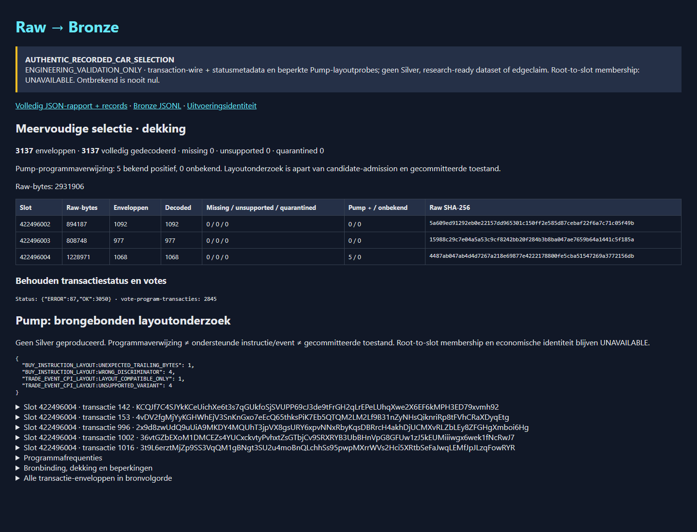

# Three authentic slots → Bronze and bounded Pump layout search

> **Document status: ACTIVE — offline partial B5 implementation, not delivery completion.**
> B4/#83 remains In Progress / ACTIVE NOW / Unproven; B5/#84 remains Backlog /
> NEXT / Unproven. The development GO authorizes existing-byte analysis, not
> acquisition, candidate promotion, Silver completion or research readiness.

## Executed selection

The original run `of1-e978-pump-search-09379cff-01` is read directly, including
its native metadata, plan, attempt, index, receipt and three payload bindings.
No reshaped one-slot run is constructed. The 302 original files and the original
acquisition executable are preserved. The separate archival reader and new
Bronze decoder execute with sockets denied; neither resumes the writer.

| Slot | Native publication | Raw bytes | CID nodes / links | Transaction envelopes | Decoded |
|---|---|---:|---:|---:|---:|
| 422496002 | 4 | 894,187 | 1,925 / 1,924 | 1,092 | 1,092 |
| 422496003 | 5 | 808,748 | 1,566 / 1,565 | 977 | 977 |
| 422496004 | 6 | 1,228,971 | 1,247 / 1,246 | 1,068 | 1,068 |
| Selection | 4–6 | 2,931,906 | 4,738 / 4,735 | 3,137 | 3,137 |

All **3,137** paired transaction-wire/status packages decode. Missing,
unsupported and quarantined envelope counts are each zero in this particular
selection, not silently omitted categories. There are **3,050 OK and 87 ERROR**
transactions; **2,845** packages reference the Vote program. Both votes and failed
transactions are retained. The archival count alone did not prove these decodes.
Entry counts are 831 / 587 / 177; each slot has one Block and one Rewards node,
and no continuation DataFrame node. Root-to-slot membership remains UNAVAILABLE.

The earlier [725-transaction result](B5_AUTHENTIC_RAW_BRONZE.md) is separate
historical evidence and remains a regression input, not overwritten evidence.



The [machine-readable execution receipt](B5_MULTISLOT_PUMP_SEARCH_RESULT.json)
binds the actual artifacts, all Raw hashes, preserved acquisition binary,
archival-reader result, toolchain, both executions and browser capture. Its
SHA-256 is `8c23f13772d43567fe63cdf7a65f785de198a405629f0e7c71b2d68e31cf965f`.
Full output remains outside Git at
`/home/dmesdary/solana-quant-data/governance/b5-multislot-20260911.ZaTeMW`.

The frozen decoder build uses source commit
`ee033a6a63909ba1092f0e7a24d2c7e60b111a1e`, executable SHA-256
`4778d7cac58922f1cdafafe32b14922064951e408ae9b76e439ba5417d746711`, and compiled
source fingerprint `d97f49c4a56e077cb762c250be24df9b3db953ba96e158178bf9b1dcd5080104`.
Both socket-denied release executions took 0.78 seconds wall time, with maximum
resident memory 243,728 / 243,852 KiB. JSON, JSONL and HTML are byte-identical:

| Artifact | SHA-256 |
|---|---|
| quality.json | `5ed4dbaf70e0d13b7983ac304c9a961f7d1e8801abc27515eba7c609f67adca2` |
| bronze.jsonl | `571c7d82c37a26b5348c2d8bbbe4cf3e22d8651c6725365047ff08b736203981` |
| quality.html | `333fb6acc39e1a65d5596dd9b6326e08310d21cf2eb9b80ca8cbeeac94f56b16` |

The old slot independently reproduces 725 decoded packages / 723 vote-program
packages / zero Pump-program references with the same new decoder; all 218 old
input files also retain their hashes. These are local offline measurements,
not acquisition throughput or general epoch-scale guarantees.

## Actual Pump result: five packages, no forced Silver match

Five packages reference the exact Pump program; all are in slot 422496004 and
have transaction status OK. The report keeps declarations, recorded CPI,
structural decoding and committed state as separate dimensions.

| Transaction order in slot | Pinned buy-instruction probe | Pinned event-CPI probe | Recorded context |
|---:|---|---|---|
| 142 | 26 bytes: UNEXPECTED_TRAILING_BYTES (candidate requires 25) | 366 bytes: LAYOUT_COMPATIBLE_ONLY | top-level Pump → Pump event CPI |
| 153 | 24 bytes: WRONG_DISCRIMINATOR | 367 bytes: UNSUPPORTED_VARIANT | top-level Pump → Pump event CPI |
| 996 | 24 bytes: WRONG_DISCRIMINATOR | 367 bytes: UNSUPPORTED_VARIANT | top-level Pump → Pump event CPI |
| 1002 | 24 bytes: WRONG_DISCRIMINATOR | 367 bytes: UNSUPPORTED_VARIANT | recorded outer program → Pump CPI → Pump event CPI |
| 1016 | 24 bytes: WRONG_DISCRIMINATOR | 367 bytes: UNSUPPORTED_VARIANT | recorded outer program → Pump CPI → Pump event CPI |

These are outcomes of the **tested buy lane**, not four successfully decoded sell
instructions. Event rejection retains the parser's actual reason: the selected
candidate requires `is_buy=true` and `ix_name=buy`. No alternate sell decoder is
introduced. The compatible event has checked full input consumption and exact
raw integer fields, exposed as `STRUCTURAL_EVENT_FIELDS_NOT_SILVER`. Its mint
bytes are not a verified economic identity; no decimals, price or lifecycle is
invented. Event-reported reserves are explicitly not account-state snapshots.

The reused source is the existing [B3 source receipt](../../schemas/protocol/pump/pump-public-docs-9c82f61-source-manifest.json):
`pump-fun/pump-public-docs`, commit
`9c82f61cb711b044a17f770ab8ce9f9bdf78f333`, `idl/pump.json`, blob
`062e66f032bb9f295353b573be3400070bd55e5b`, SHA-256
`b90bc471327f671449271d5d1d42354d1fae6f5a06502f5834459a3108138e49`.
This is pinned structural authority, not proof of historical on-chain activation.

**No Silver is produced.** One event-layout match does not repair the incompatible
associated instruction or establish candidate uniqueness and account layout.
The analyzer does not call `resolve_registry_candidate` or supply a candidate
count. It does not emit an activation claim, committed Pump state or executable
economics. Missing CPI heights leave parent context unknown; failed transactions
cannot acquire a committed-state claim from a byte-layout match.

The smallest next step needs **no further download**: inspect an exact official
source revision for the observed 26-byte buy and its account layout, then prove
one observation-derived candidate selection and instruction/event context over
these preserved bytes. That is a separately reviewable decoder increment, not
permission to broaden the current B3 candidate or promote these observations.

## Implementation and limits

- The existing Rust reader accepts one to three complete native slot ranges in
  plan order, epoch 978 only. Duplicate/nonincreasing slots and incomplete planned
  selections fail closed. It retains original source offsets and resets derived
  transaction order per slot.
- Total selected Raw is bounded at 16 MiB. Existing per-slot 4,096-node,
  16,384-link, 2 MiB frame and 8 MiB zstd-window limits remain unchanged.
  Serialized record and decompressed-metadata budgets remain 16 MiB each per
  slot, with explicit 48 MiB selection budgets. These are offline reader limits,
  not acquisition-cap changes or a full-epoch scaling claim.
- A structural failure stops report publication. Individual missing/unsupported/
  corrupt transaction packages retain an explicit outcome. Original bytes remain
  available even when projected fields are unsupported.
- B3's two existing parsers are shared through explicitly structural probe
  functions. Validated-candidate APIs still validate first and use identical
  parser bodies. No old B3 fixture/matrix/source receipt is changed.
- One local `pump-protocol-v2` dependency adds its locked Borsh derive/TOML
  build-time graph. The [review](../../rust/of1-bronze-decoder/dependency-review.json)
  binds packages, features, licenses and build-script hashes. No transport,
  Solana RPC, signer, system package or runtime provider is added. The compiled
  decoder fingerprint includes the actual B3 probe/registry/library bytes and
  source receipt, not just the Cargo path dependency.
- Program frequencies distinguish unique transaction presence, declared
  top-level references and recorded CPI references. None is a successful
  state-change count. Unavailable domain/economic fields remain unavailable.

## Reproduction and visible output

From the repository, with the existing pinned toolchain:

```bash
TOOLCHAIN_RUN=/home/dmesdary/.local/share/solana-quant/run-with-toolchain
"$TOOLCHAIN_RUN" node scripts/assert-of1-bronze-offline.mjs --all
"$TOOLCHAIN_RUN" cargo build --locked --offline --release \
  --manifest-path rust/of1-bronze-decoder/Cargo.toml
rust/of1-bronze-decoder/target/release/of1-bronze-decoder \
  /home/dmesdary/solana-quant-data/runs/of1-e978-pump-search-09379cff-01 \
  /home/dmesdary/solana-quant-data/governance/b5-multislot-review-new
```

Choose a **new** output directory with an existing parent. Never point output at
an original run. Require `COMPLETE` and verify `execution.json` artifact hashes.
The JSON, JSONL and standalone HTML contain all envelopes, per-slot summaries,
signatures, status/fees, program frequencies and the five bound Pump cases.
Operational processing clocks are separate from deterministic data artifacts.

For the already executed result, open **http://localhost:4174/quality.html** in
the Windows browser. Restart that read-only file server if needed:

```bash
python3 -m http.server 4174 --bind 127.0.0.1 \
  --directory /home/dmesdary/solana-quant-data/governance/b5-multislot-20260911.ZaTeMW/release-01
```

The browser capture checked HTTP response bytes against the Rust HTML hash,
3,137 rendered transaction rows, all three slots, five Pump-case panels and the
no-Silver warning. It recorded no page request outside loopback and no warning;
this is a page-level check, not a claim about all operating-system traffic.

Acceptance executes two socket-denied release decodes and compares JSON/JSONL/
HTML byte-for-byte. Small authentic sections have exact Raw/CID/span receipts;
synthetic mutation/context/multi-slot harnesses are labelled Fixture. Tests cover
missing/corrupt middle publication, receipt/index drift, selection caps, signed
Shredding retention, CPI height gaps, non-Pump programs carrying event bytes,
failed/missing-CPI contexts and unchanged B3 parser parity. No provider traffic,
acquisition approval, Project promotion, lease extension or B5 completion follows.
