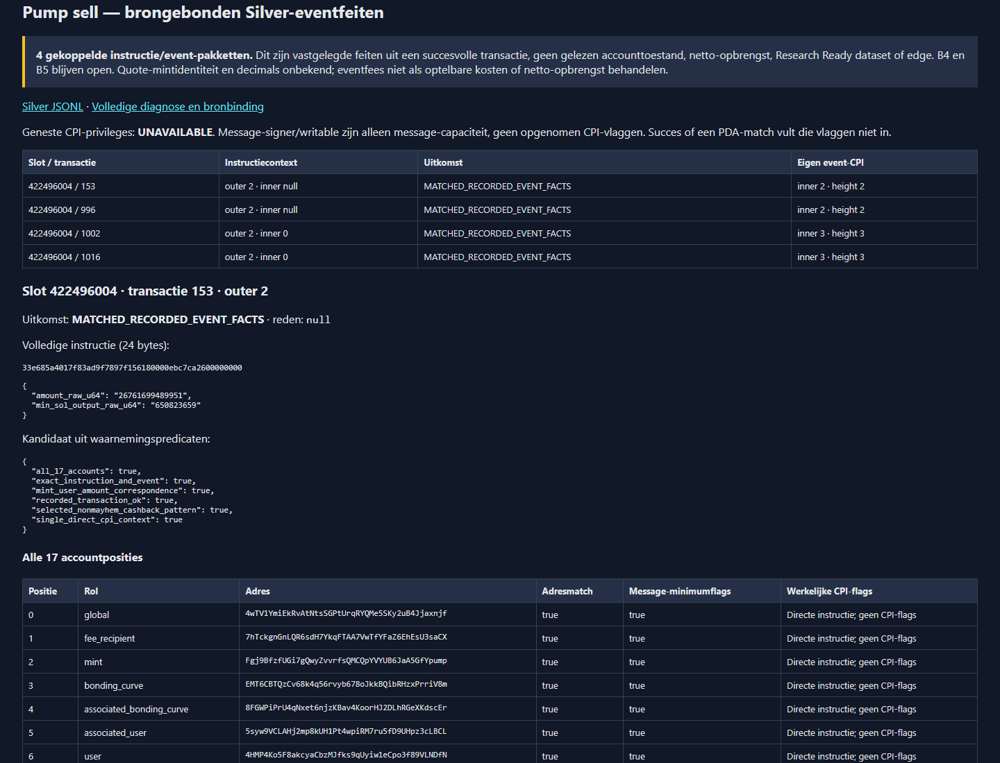
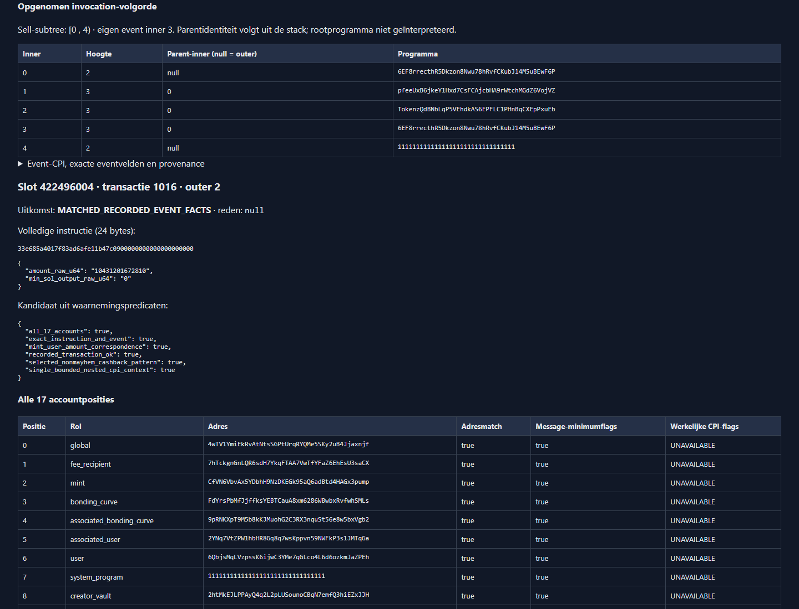

# B5 — bounded nested Pump sell/event association

> **Document status: ACTIVE.** Local stacked follow-up from `765263f5d948576a7d294b0d1ef649be105f9e60`; no GitHub operation, acquisition or Project promotion. B4 remains open and B5 remains NEXT. See the [prior direct-sell evidence](B5_PUMP_SELL_OBSERVATION.md), which is preserved, not rewritten.

## Scope and source rule

Only the already captured height-two Pump sell calls in slot 422496004,
transactions 1002 and 1016, are added. The same exact 24-byte sell instruction,
367-byte event representation, 14 IDL accounts plus three documented remaining
accounts, all address/PDA checks, exact integers, successful transaction status
and complete Raw/receipt/Bronze bindings remain required. The original buy at
index 142 still rejects its unexplained 26th byte. Direct sells 153/996 retain
their original route and source receipt.

The new [source receipt](../../rust/of1-bronze-decoder/sources/pump-nested-sell-evidence.json)
binds the preserved Pump pin `9c82f61cb711b044a17f770ab8ce9f9bdf78f333`
and ordered inner-instruction/stack-height definitions from already retained
Agave `6c1ba34691f17ac902ae3d2e1147eed5723b9cef` and solana-message 3.0.1
source bytes. Each file has an exact path/hash and provenance status. No new
source download, dependency, program activation claim or router decoder.

## Own event, not a neighboring invocation

Both recorded groups have this order beneath outer instruction 2:

| Inner order | Height | Program role | Parent inner |
|---|---|---|---|
| 0 | 2 | Selected Pump sell | null (outer instruction) |
| 1 | 3 | Fee program | 0 |
| 2 | 3 | Token-2022 | 0 |
| 3 | 3 | Pump event-CPI | 0 |
| 4 | 2 | System program, subsequent sibling | null |

The selected subtree is `[0,4)`. Validate the complete recorded group before
selection, including calls after the event. Never sort, fill missing heights,
use log text as a fallback, or search a neighboring subtree for an event.
Exactly one immediate Pump event child must have the correct authority, exact
layout and matching mint/user/token amount. A deeper child's event is not the
selected sell's event. The outer program is recorded, not interpreted.

Message account flags remain checked as necessary capacity. Recorded compiled
CPI instructions contain indices, bytes and optional height, **not CPI signer
or writable flags**. Those flags remain `null` /
`UNAVAILABLE_NOT_RECORDED_IN_STATUS_METADATA`; no inference from PDA seeds or
transaction success. Every nested account row labels its message-minimum check
separately and sets `cpi_privileges_verified=false`.

Admitted Silver is an atomic recorded instruction/event fact, not proof of
complete CPI privileges, account writes, balance deltas, economic identity,
decimals, executable price, launch time, historical activation or an edge.
The observed zero quote-mint bytes are retained without inventing a mint.
`ENGINEERING_VALIDATION_ONLY` and root-to-slot membership `UNAVAILABLE` remain.

## Verification and visible output

The focused suite checks both authentic sealed sections plus synthetic negative
cases: missing/wrong heights, sibling/deeper calls, duplicate events, swapped
contexts, order corruption, every account, message capacity, failed transactions,
truncated events and missing provenance. A synthetic native Raw/receipt fixture
also executes the nested route without relabeling its provenance as authentic.

The existing Rust-generated `quality.html` shows all four sell outcomes,
17-account checks and the full ordered nested trace. `quality.json`,
`bronze.jsonl` and `silver.jsonl` retain the machine-readable evidence.
Execution identities, full-run counts, deterministic comparisons and completed
local gates are bound in the [compact result receipt](B5_NESTED_PUMP_SELL_CONTEXT_RESULT.json).
Its SHA-256 is `5441e81c19b77980f0d1350260dfefc864207ef5dc85e94a94cbfbc328a18f40`;
the full retained result outside Git has SHA-256
`ee5f1af7c05768fadf8ba2c3b1b08ec3e9a9f9c58f63a4c9c07aa85b126f814f`.
These are executed observations, not inferred from test descriptions.

### Completed local gates

- Existing Node 22.23.2 / Rust 1.97.1, `npm ci --offline`; unchanged manifests,
  locks, dependency graph, build scripts, original fixtures and CI configuration.
- Node/Vitest: 104 files, 1,568 tests; critical policy/Pump suite: 101 tests.
- Bronze Rust: 74 tests, including 14 new nested-context regressions and one new
  native Raw/receipt test. All previous codec/direct-sell/buy/native gates remain.
- Repository policy, research citations, TypeScript, default build and all
  retained Rust format gates passed. Full Pump, OF1 and Bronze offline gates,
  reducer clippy/tests/build passed; clippy warnings denied.
- All full gates passed on the first complete attempt (18:32:29–18:47:43 UTC).
  No unchanged full-gate rerun or assertion relaxation; prior failure evidence
  from earlier deliveries stays untouched.
- Independent retained-source/diff, authentic-artifact and doc/screenshot reviews
  found no blocking issues. All internal document links and `git diff --check`
  passed. Final documentation changes receive separate policy/link checks.

GitHub CI and ordinary Roadmap Sync are **not run**: the explicit local-only
boundary forbids GitHub access/publication. Those checks and remote review must
follow only when separately permitted. Main, PR #117 and the previous local
sell branch are unchanged. There is no merge or Project/Evidence promotion.

## Executed authentic result — 2026-09-12

Implementation commit `a3be6ff49a6ed60b5108f716735797960f7158e3`, release
executable SHA-256 `e20f35d965cc466fbdb6bfbfeb8820f4907e09e4fccbb563bdcf7f7563208d7a`,
compiled decoder-source fingerprint
`8d8786c7db9cb7cc85c29da699452be4adbba3f551cd4b92971dd1dd1e32e545`.
The separate reader was built and executed with sockets denied using the
existing local seccomp helper; the original acquisition executable was not
rebuilt, replaced or resumed. No dependency/lockfile changed.

| Slot | Authentic envelopes | Decoded | Missing / unsupported / quarantined |
|---|---:|---:|---:|
| 422496002 | 1,092 | 1,092 | 0 / 0 / 0 |
| 422496003 | 977 | 977 | 0 / 0 / 0 |
| 422496004 | 1,068 | 1,068 | 0 / 0 / 0 |

All 3,137 packages remain present: 3,050 successful and 87 failed transactions,
including 2,845 vote-program transactions. Successful transaction-wire/status
decode is not universal Pump support. The five Pump-referencing packages yield
four admitted sell facts and the separately rejected buy. The 725-transaction
regression also decodes completely and yields no Silver sell facts.

| Transaction in slot 422496004 | Route | Amount raw u64 | Event `sol_amount` raw u64 | Result |
|---|---|---:|---:|---|
| 153 | Existing direct | 26761699489951 | 939139477 | Preserved recorded sell fact |
| 996 | Existing direct | 33039135172779 | 1090390855 | Preserved recorded sell fact |
| 1002 | Nested height 2, own event height 3 | 15071528820578 | 2205351813 | Additional recorded sell fact |
| 1016 | Nested height 2, own event height 3 | 10431201672810 | 1446431596 | Additional recorded sell fact |

Numbers above are named wire/event integers, **not** decimal-adjusted prices or
net proceeds. Both nested cases report mint
`CfVN6VbvAx5YDbhH9NzDKEGk95aQ6adBtd4HAGx3pump`; its ticker, name and launch
date remain unknown. All 17 account addresses and message-capacity checks pass;
actual CPI signer/writable flags remain unavailable.

Two complete reader executions produced identical `quality.json`,
`bronze.jsonl`, `silver.jsonl`, `quality.html` and `COMPLETE` bytes. Silver JSONL
SHA-256: `c61314047b7acbb75c935fd98bfe4a7a152ef422a2ca1b65edf0760d58e4f5ac`.
Bronze JSONL SHA-256:
`001db7f0a5081328c1d8bfa7090bb0b92203921cf8cf53da1b2a9c4403a31a93`.
Each Silver fact binds its exact complete Bronze JSON record. Comparison with
the previous reader preserves all prior fields except the new code identity
and the two intentionally extended nested-sell diagnoses; direct-sell semantics
and the full buy diagnosis are unchanged.

Observed elapsed time: 0.93 seconds each for the three-slot selection;
peak RSS 254,076 / 253,956 KiB. The 725 regression took 0.22 seconds with
53,768 KiB peak RSS. These are local measurements, not a scale guarantee.
All 302 + 218 original runfiles and earlier reports/binaries were rehashed
before and after and stayed unchanged.

### View locally

New immutable output directory on WSL ext4, outside Git:
`/home/dmesdary/solana-quant-data/governance/b5-nested-sell-20260912.c012J5/release-01`.
The independent second execution is `release-02`, earlier-slot regression is
`regression-725`, and actual browser capture evidence is `browser-01` alongside
it. JSON/HTML files are self-contained and do not query a provider.

Current Windows-browser URL: `http://localhost:7016/quality.html#pump-sell`.
If the temporary review server has stopped, run from WSL using existing Windows
Node (only serves these immutable files; printed port is OS-assigned):

```bash
'/mnt/c/Program Files/nodejs/node.exe' \
  '\\wsl.localhost\Ubuntu\home\dmesdary\solana-quant-data\governance\b5-nested-sell-20260912.c012J5\serve-report-windows.mjs'
```

This viewer does not alter the Node/Rust development toolchain. No install,
profile, firewall or Windows configuration change. The browser capture checked
served HTML hashes, 3,137 rows, all four sell outcomes, both ordered traces,
17-account tables and zero unexpected page requests/warnings.





## Smallest next queryable-data step (not implemented here)

Make the bounded physical-writer decision explicit: one lossless Rust-owned
Parquet/Arrow projection of these existing Bronze/Silver records, with schema,
manifest and logical-hash parity against JSON. Demonstrate one read-only query
over slot/order, mint, raw quantities, provenance and unsupported outcomes.
This needs neither another download nor Python Pump decoding, a universal
router, a full lifecycle, strategy research or a new monitoring stack.
