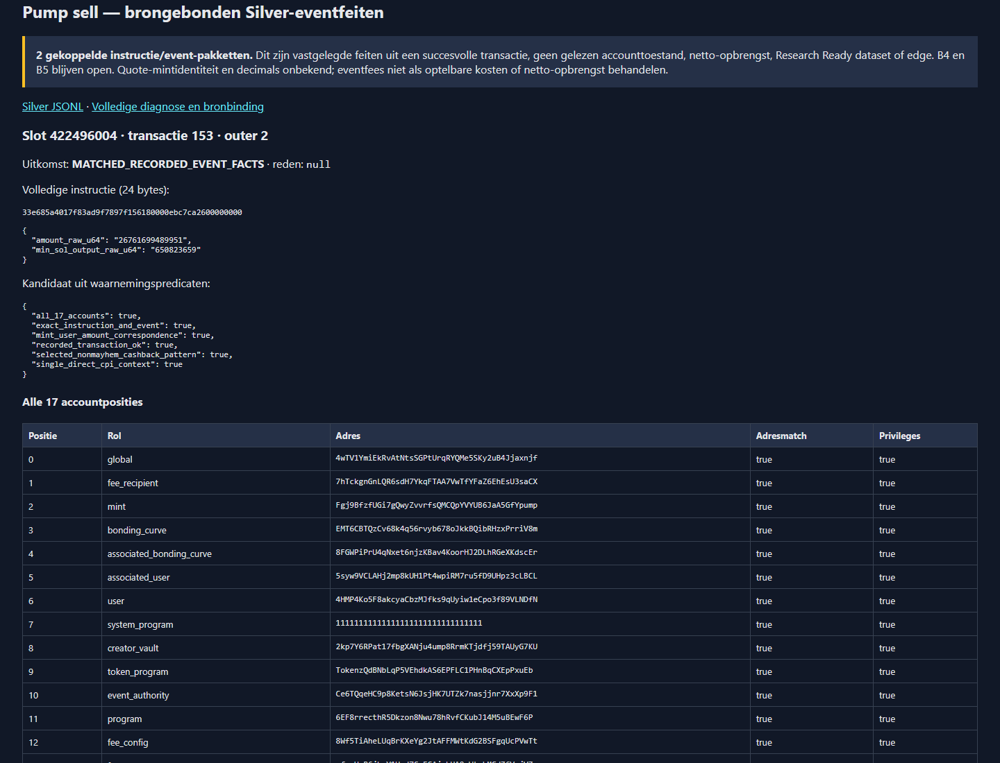
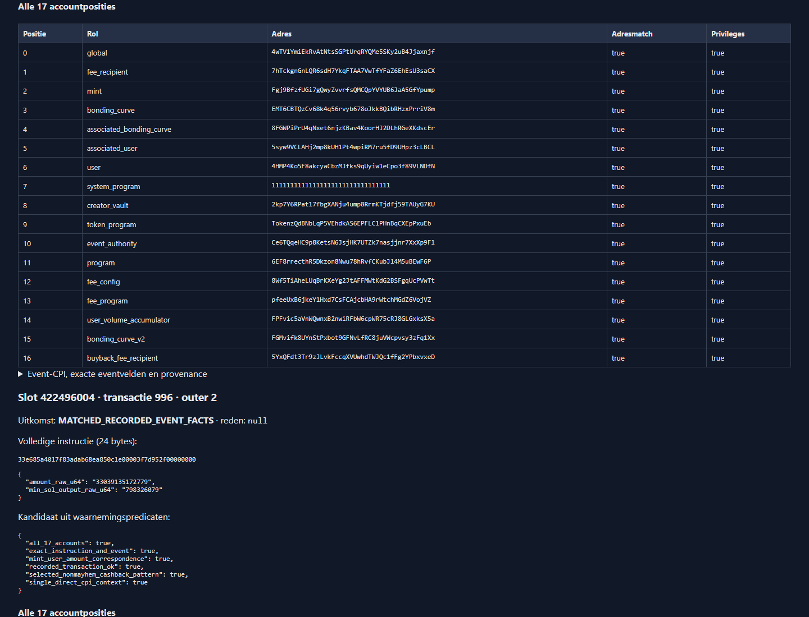

# Bounded recorded Pump sell → Silver event facts

> **Document status: ACTIVE — local offline B5 preparation, not delivery completion.**
> This follow-up starts at the explicitly authorized local commit
> `21de55dfb9fb4b42caad8df0d8bbe3fa89920969`. The earlier buy branch/PR is unchanged.
> B4/#83 remains In Progress / ACTIVE NOW / Unproven; B5/#84 remains Backlog /
> NEXT / Unproven. GitHub access, acquisitions and Project mutations are not authorized.

## Source and selected observation

Slot `422496004`, transaction `153`, outer instruction `2` contains exactly 24
sell bytes, not an unexplained prefix. The unchanged [authentic CAR section](../../rust/of1-bronze-decoder/tests/fixtures/authentic-pump-sections.json)
is decoded through the existing complete transaction-wire/status pipeline.
Raw SHA-256: `4487ab047ab4d4d7267a218e69877e4222178800fe5cba51547269a3772156db`.

The [source receipt](../../rust/of1-bronze-decoder/sources/pump-sell-evidence.json)
reuses only already retained files, verified offline against their hashes:

- Official Pump repository commit `9c82f61cb711b044a17f770ab8ce9f9bdf78f333`,
  [`idl/pump.json`](https://github.com/pump-fun/pump-public-docs/blob/9c82f61cb711b044a17f770ab8ce9f9bdf78f333/idl/pump.json),
  blob `062e66f032bb9f295353b573be3400070bd55e5b`, SHA-256
  `b90bc471327f671449271d5d1d42354d1fae6f5a06502f5834459a3108138e49`.
- Same-pin `docs/BREAKING_FEE_RECIPIENT.md`, SHA-256
  `8b05e0906eaf1746508b0b2f909ac7c344ce7be33a6564d595335c9fda399868`;
  `docs/PUMP_CASHBACK_README.md`, SHA-256
  `f8375a40e45c87a1cbdd50bbce744a8d7c2b9d901a1365090ff513605d24cb23`;
  the same-pin fee recipient list.
- Already retained official README-linked SDK source package `1.36.0`:
  `src/sdk.ts` SHA-256 `242736485abfa36648646b07e5b81b6e7bd4fe5a074411ebd790bc029e534b80`,
  `src/pda.ts` SHA-256 `f6311abd14dea28e80cdb852f2363ef958ec48f470a0d16c8d4cf78694c9f972`.
  SDK Git head remains registry-declared, not independently Git-verified.

No source was newly fetched. Documentation is not historical activation proof.
The full unlicensed IDL remains outside Git, not newly vendored.

| Surface | Observed bytes / interpretation |
|---|---|
| Instruction | `33e685a4017f83ad9f7897f156180000ebc7ca2600000000` |
| Discriminator | `33e685a4017f83ad`, exact pinned `sell` |
| `[8,16)` amount u64 | `26761699489951` |
| `[16,24)` min_sol_output u64 | `650823659` |
| Instruction SHA-256 | `bee483bc1525bb1cfa55b25f94a2c3848ad41ba2d5c0a21b1d5b24ce997d8da7` |
| Event | 367 bytes, `is_buy=false`, `ix_name=sell`, full Borsh exhaustion |
| Event-CPI SHA-256 | `d26a7bd6420252a2ba13e5f17d0d2a3ad5d0f36c1509d2d85289f1532bead3bb` |
| Context | outer 2 / inner order 2 / stack height 2, direct Pump parent, event authority |

## Seventeen accounts, not an extra instruction layout

The selected pattern has fourteen pinned IDL roles, followed by the documented
writable user-volume accumulator, readonly bonding-curve-v2 and writable buyback
recipient. These are remaining **accounts**, not extra instruction bytes.

| Position | Role | Required writable / signer |
|---:|---|---|
| 0 | global | no / no |
| 1 | fee_recipient | yes / no |
| 2 | mint | no / no |
| 3 | bonding_curve | yes / no |
| 4 | associated_bonding_curve | yes / no |
| 5 | associated_user | yes / no |
| 6 | user | yes / yes |
| 7 | system_program | no / no |
| 8 | creator_vault | yes / no |
| 9 | token_program | no / no |
| 10 | event_authority | no / no |
| 11 | program | no / no |
| 12 | fee_config | no / no |
| 13 | fee_program | no / no |
| 14 | user_volume_accumulator | yes / no |
| 15 | bonding_curve_v2 | no / no |
| 16 | buyback_fee_recipient | yes / no |

The actual token program is Token-2022, not Tokenkeg. Minimum compiled-message
privileges include the V0 loaded addresses. A readonly role may be globally
writable. Nine offline PDA/ATA calculations match the sealed cross-language
reference. ATA/PDA correspondence is not proof of account contents, token-account
ownership or a read of `is_cashback_coin`; creator-vault uses the event-reported
creator, not a separately read curve account.

## Admission and output semantics

One registered profile: `pump-sell-9c82f61-token2022-cashback17-direct-v1`.
The code derives its match from actual full instruction/event bytes, direct
invocation context, seventeen distinct address/privilege matches, documented fee
recipients, mint/user/amount agreement, the selected non-mayhem/no-shareholder/
track-volume-false pattern and archived successful transaction status. There is
no caller-provided compatible count or hardcoded slot/transaction allowlist.
Uniqueness is **within this bounded registered profile**, not a survey of all
historical deployed Pump versions. Nested calls remain explicitly unsupported.

Silver `PUMP_SILVER_RECORDED_SELL_1` is one atomic instruction/event fact package.
It binds the original complete Bronze record hash, native run/receipt/index
bindings, Raw/CID/section identity, transaction-wire/status hashes, signatures,
slot/order, source receipt and actual decoder identity. Output uses new directories;
neither writer state nor old reports/manifests are rewritten. `silver.jsonl` is
hashed in `execution.json` and published before the durable COMPLETE marker.
JSON is this bounded review format, **not the physical Parquet writer decision**.

Numeric wire fields remain exact decimal strings. Event reserves are not account
state. Event `fee=8921826` is not the fee-recipient balance increment `4460913`;
the buyback field is also `4460913`. Do not add these into an invented net fee.
Cashback is event-reported `2817419`; other instructions, tips and transaction
fees affect balances. No instruction-level net proceeds are inferred.

The event's quote mint is 32 zero bytes. They remain raw bytes with **UNKNOWN
economic identity**, not a default SOL/WSOL mint. The Token-2022 TransferChecked
decimals byte is not promoted to canonical mint decimals by this component.
Names, ticker, launch date, quote/base decimals, executable price, activation
range and account-write state remain unknown/not established. The transaction's
archived OK status alone does not prove any of those facts. Signature cryptographic
verification and root-to-slot membership are not established by this reader.

The [26-byte buy diagnosis](B5_PUMP_BUY_SOURCE_BINDING.md) is preserved separately:
its extra byte is still unexplained, full-input rejection remains intact, and
neither B3 parser behavior nor the old evidence matrix is changed.

## Offline checks and scope

Authentic sections are reused byte-for-byte; synthetic boundary/negative cases
are explicitly labelled. Tests cover full-input bounds, integer limits, Borsh
corruption, malformed and duplicate event context, all account positions, V0
privileges, failed/unknown status, source identity, provenance and deterministic
JSON/HTML. The synthetic native-run harness keeps Fixture receipts and tests
Raw → Bronze → Silver binding without forging an authentic run.

Only `borsh =1.8.0` becomes an additional **direct** dependency to reuse the
existing bounded TradeEvent wire type. It was already in Cargo.lock; the resolved
packages, features, licenses and build scripts are unchanged. No package download,
network client, provider, signer, system install or global toolchain change.
The existing per-slot/selection output cap now includes derived Silver bytes;
no acquisition or reader budget is increased.

## Executed local result — 2026-09-12

Code commit `79b2d9a0c7422c3d9fc648daf1d6bc9d87997a57` was built with Node
`22.23.2` / Rust `1.97.1`; the subsequent evidence-only commit does not replace
that executable identity. Full outputs and original logs are retained outside Git:

```text
/home/dmesdary/solana-quant-data/governance/b5-pump-sell-20260912.xNETcu/
  bin/of1-bronze-decoder-f39dcf44ad0db0f3e516ab33fefb4f667374bdb97c7082f3814b7129c8664154
  release-01/quality.html
  release-01/quality.json
  release-01/bronze.jsonl
  release-01/silver.jsonl
  release-01/execution.json
  release-02/
  regression-725/
  browser-03/
```

| Authentic recorded selection | Transaction envelopes decoded | Sell facts |
|---|---:|---:|
| 422496002 | 1,092 | 0 |
| 422496003 | 977 | 0 |
| 422496004 | 1,068 | 2 |
| Total | 3,137 | 2 |

All transaction envelopes are accounted for: 3,050 recorded OK, 87 ERROR and
2,845 retained vote-program transactions. There is no silent filtering. These
transaction counts do **not** mean all Pump variants were admitted. Direct sells
153 and 996 match the same observation-derived bounded profile; nested sells
1002 and 1016 remain `UNSUPPORTED_INVOCATION`. Buy 142 remains the unchanged
`UNEXPECTED_TRAILING_BYTES` diagnosis. The 725-transaction regression also passes
with zero sell facts. All prior Bronze fields, including buy diagnostics, are
deep-equal apart from the new decoder identity and separate sell-analysis field.

Two new full-selection executions produced byte-identical quality JSON, Bronze
JSONL, Silver JSONL, HTML and COMPLETE files. Runtime was 0.91 / 0.93 seconds;
peak RSS was 252,976 / 252,992 KiB. These are local reader measurements, not
general throughput guarantees. Combined serialized Bronze/Silver records occupied
29,885,331 bytes within the unchanged 48 MiB selection cap. All 302 + 218 original
run files, original acquisition executable and retained earlier reports are
hash-unchanged.

| Artifact | SHA-256 |
|---|---|
| New offline decoder executable | `f39dcf44ad0db0f3e516ab33fefb4f667374bdb97c7082f3814b7129c8664154` |
| Compiled decoder source fingerprint | `2dc96d127d88f051f64182ad2c5af02be3f1c9a509818c0874e5fda0f4665880` |
| Cargo.lock | `1a6e486fc422e5ee9b5e54b8d4b63b567c560cf61f96c3b0284a503c752eff08` |
| quality.json | `abd6503151ebc2c551dc3d33ed32349c588dfb96226f97028749913ef52963c3` |
| bronze.jsonl | `0f115a4b7e97b57266cf049005a020771f71cc04b990b70b2a794f76fadd0b47` |
| silver.jsonl | `55fc2dc48bf0343d3753751b2a6e8bfe8615a075f3b0c3df51ae7827e903548c` |
| quality.html | `681e7e9fdcd1bd9db7c17e3cf8bd0c72306d2d899774e9153fcfcc70320290eb` |

The [machine-readable result receipt](B5_PUMP_SELL_OBSERVATION_RESULT.json) is
byte-identical to the retained outside-Git `result.json`, SHA-256
`d78f416ec339389fa89e14275ffb99f73904a9d699f70b23a049c2c71b939904`.
It binds both executions, original-input inventories, source/executable identities,
per-fact Bronze hashes, screenshots and exact local gate logs.

### Local gates and review

- Offline lockfile-bound npm install; policy and research-citation gates: pass.
- Complete Vitest suite: **104 files / 1,568 tests**; critical suite: **101 tests**.
- TypeScript no-emit and default build: pass.
- All retained Rust formatting gates, Pump offline gates and reducer
  clippy/tests/build: pass.
- Bronze dependency/license/build-script parity, socket-denied fmt/clippy/tests/
  build: pass; **59 tests**, including 15 focused sell tests and ten native-run
  tests. Authentic 3,137 / 725 execution regressions are separately recorded.
- The first full OF1 gate failed in the **unchanged** monitor metadata fixture:
  `Broken pipe (os error 32)` followed by `fixture missed deliberate interruption`.
  One complete repetition of the same gate passed, including all assertions,
  crash/restart, payload simulation and reader checks. Both logs remain in the
  result receipt. The precise TLS timing cause was not instrumented; retain this
  as a separate fixture-maintenance observation, not a repaired sell-code defect.
- Internal Markdown links and `git diff --check`: pass.
- Fresh independent local review found no blocking source, decoder, provenance,
  evidence or screenshot issue. It rechecked both authentic executions, old
  records and preserved files. This is not a GitHub review or CI conclusion.

### View the actual result

The Windows browser was exercised against the actual Rust-generated HTML at
`http://localhost:4792/quality.html#pump-sell`. The captured response hash equals
the retained HTML hash. Both screenshots show actual data, not a UI mockup:





The existing Windows Node serves these read-only files directly from WSL ext4.
If the temporary viewer has stopped, run from WSL (it prints an OS-assigned port;
use the printed URL):

```bash
'/mnt/c/Program Files/nodejs/node.exe' \
  '\\wsl.localhost\Ubuntu\home\dmesdary\solana-quant-data\governance\b5-pump-sell-20260912.xNETcu\serve-report-windows.mjs'
```

No Windows configuration, firewall, shell profile or installed tool was changed.
The review helper is outside Git, loopback-only and has no acquisition controls.
The HTML is also independently readable from disk. Browser evidence covers page
requests, not an OS-wide packet capture. Earlier failed loopback attempts and the
initial compiler subprocess-filter failure remain retained, not relabelled green.

GitHub CI and ordinary Roadmap Sync must run only after access and publication
are separately permitted. This local development does not contact GitHub,
change PR #117, merge, close issues or promote Project evidence. The smallest
separate decode follow-up is a source-backed association for the two retained
nested sells; it does not require a new download. The buy suffix needs its own
missing authoritative compatibility evidence and remains unmodified.
