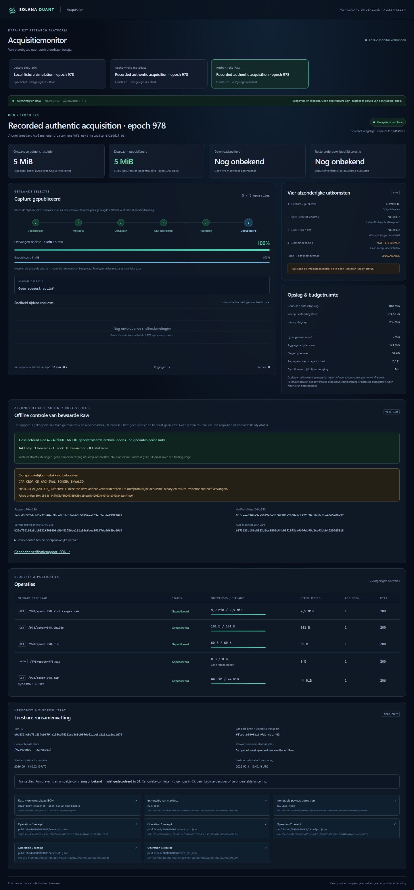

# Recorded OF1 CAR verification — bounded offline repair

> **Document status: ACTIVE.** B4/#83 remains In Progress / ACTIVE NOW / Unproven;
> B5/#84 remains Backlog / NEXT. This is a read-only verifier repair, not an
> acquisition lease, writer resume, domain decoder or Project evidence promotion.

## Captured evidence and original failure

The separately approved 2026-09-11 run retained four metadata publications and
one authentic payload publication. Its identity is
`e0e5314c9d73c237eb6794a153cd75111cd8c3cb996b51abe3a2a5aac2cc1d79`.
The payload request was epoch 978, selected slot `[422496000, 422496001)`,
`GET /978/epoch-978.car`, range `bytes=59-45109`.
One HTTP 206 response published exactly **45,051 entity bytes**, with no retry.
No provider call is part of this repair.

| Identity | Preserved value |
|---|---|
| Raw SHA-256 | `3d93337542751eaacecf039a2fb5384f700f226879616b3fb80117fb9d4a8ae6` |
| Payload receipt file SHA-256 | `9a158eec0cd4f5a445fa34b4b7f18e4c0d720a198cec7ceae5c3279c3245104f` |
| Original acquisition executable SHA-256 | `d6774c7197468710ae07bc5770388963b9175b0c1b7d4f22e93b33a1230aeda0` |
| Original offline verification | `CAR_CBOR_OR_ARCHIVAL_SCHEMA_INVALID` |
| Slice class | `ENGINEERING_VALIDATION_ONLY` |

The original run remains at
`/home/dmesdary/solana-quant-data/runs/of1-e978-metadata-0725dd2f-03`.
Its payload is `published/0000000004/raw.bin`, alongside `receipt.json`.
Original approval, lease, deadline, executable, manifests, receipts and the
failed verifier result remain immutable. The execution history remains in
`/home/dmesdary/solana-quant-data/run-executions/of1-e978-payload-0725dd2f-01`:
`offline-integrity-failure.json`, `payload-result.json` and `RUN_RESULT.md`.
The new success does not overwrite or retroactively change that failure.

The complete [hex-encoded authentic regression bytes](../../schemas/acquisition/of1/epoch-978-slot-422496000.observed.car.hex)
decode to the same 45,051-byte Raw hash. Their separate
[provenance](../../schemas/acquisition/of1/epoch-978-slot-422496000.observed.provenance.json)
distinguishes authentic input from generated synthetic boundary cases. This
fixture representation neither changes original bytes nor authorizes a fetch.

## Source-bound correction, not general CBOR relaxation

The exact official source is
[`anza-xyz/jetstreamer`, commit `cffaf3d891b3cbe45a46dd963d6d3571b2aa1a24`, `jetstreamer-firehose/src/block.rs`](https://github.com/anza-xyz/jetstreamer/blob/cffaf3d891b3cbe45a46dd963d6d3571b2aa1a24/jetstreamer-firehose/src/block.rs).
The retrieved 134,494-byte file has SHA-256
`835727aa3d4dea938a967ae9394bb682ba0065475d7fc10566a4631c8c6a368c`.
It declares both `Shredding.entry_end_idx` and `Shredding.shred_end_idx` as
`i64`. The source is format evidence, not proof of historical Pump activation.

Only those two positions change from `uint()` to checked signed-i64 parsing.
Canonical CBOR major types 0 and 1 represent values within
`[-9223372036854775808, 9223372036854775807]`; larger magnitudes reject.
The existing unbounded opaque-integer helper is not used for these fields.
Upstream unchecked casts/defaults are not imported. `-1` stays `-1`: no zero
substitution or invented sentinel meaning.

Unsigned slot, parent, `Entry.num_hashes` and other fields are unchanged. Definite
arrays, pair lengths, canonical integer encoding, full CBOR/input consumption,
CID profile/content hashes, selected-slot consistency, link target kinds,
duplicate/missing/unreachable nodes and graph-cycle checks remain mandatory.

The original-call regression reaches the same authentic Block bytes and proves
that the former `uint()` rejects each of the 63 `-1` values in the second
Shredding position. Synthetic tests independently exercise both positions with
`-1`, zero, i64 minimum/maximum, positive and negative overflow, wrong types,
noncanonical/reserved CBOR, truncation, pair shape and trailing bytes. Negative
unsigned fields still reject. No expected source byte is rewritten to pass.

## Complete bounded result and limits

The corrected complete CAR/CID/selected-slot/link verifier accepts this exact
range, not just its individual content hashes:

| Archival envelope result | Count / state |
|---|---|
| Verified nodes / links | 66 / 65 |
| Entry | 64 |
| Rewards | 1 |
| Block | 1 terminal Block for slot 422496000 |
| Transaction | 0 |
| Standalone DataFrame | 0; inline DataFrame bytes are not domain-decoded |
| Root-to-slot membership | `UNAVAILABLE` |
| Whole epoch CAR hash | Not verified by a partial range |
| DataFrame checksum/decompression | Not evaluated |
| Domain decoding | `NOT_PERFORMED`; domain counts remain `UNAVAILABLE_NOT_DECODED_IN_B4` |

This is a valid transaction-empty archival Block under the selected envelope
contract. Complete captured link closure establishes that its Entry envelopes
do not refer to missing Transaction envelopes; it does not establish epoch-wide
coverage, ledger replay validity, consensus finality or anything about other
slots. Zero Transaction **envelopes here** is not a browser-invented domain
count, a Pump observation, a decoded transaction dataset or evidence of no edge.

## Separate read-only binary and externally retained report

[`of1-verify-recorded`](../../rust/of1-range-recorder/src/bin/of1-verify-recorded.rs)
is a separate binary built with default features and the existing lockfile.
It does not call `AcquisitionStore::resume`, acquire the writer lock, mutate
the old run, grant authority, refresh a deadline or provide a network adapter.
It verifies recorded manifests, attempt/receipt/Raw bindings, reconstructs the
prepared payload from the four existing metadata receipts, and checks exact
published range bytes. Bounds limit file reads, assembly, nodes and links.
The recorded inputs are audited again before producing a result.

The stdout JSON schema `OF1_OFFLINE_VERIFICATION_1` binds run/root, aggregate and
payload manifests, all receipt file hashes, Raw hashes/lengths, prepared payload
and metadata-receipt identities. It measures its own executable SHA-256 and a
length-framed digest of the compiled verification sources and lockfile. These
identify this reader; they do not replace the old acquisition identity or claim
an independently attested build. Retain the actual binary and build evidence.

The optional historical pair `--prior-failure` and `--prior-run-result` must
match the same run, Raw and original executable; the result records both file
hashes. A missing optional history is explicit, never manufactured. Invalid
receipt/binding input produces an error, not a successful report. CAR failure
produces `QUARANTINED` with its exact reason and no partial successful slot facts;
incomplete payload produces `INCOMPLETE`. The CLI exits nonzero for either.

### Local replay and browser

The following is entirely offline. Build only the new reader; do not replace
the separately retained acquisition executable or invoke its resume command:

```bash
cd /home/dmesdary/code/Solana-Quant-Bot
/home/dmesdary/.local/share/solana-quant/run-with-toolchain \
  cargo +1.97.1 build --offline --locked --release \
  --manifest-path rust/of1-range-recorder/Cargo.toml --bin of1-verify-recorded

rust/of1-range-recorder/target/release/of1-verify-recorded \
  /home/dmesdary/solana-quant-data/runs/of1-e978-metadata-0725dd2f-03 \
  --prior-failure /home/dmesdary/solana-quant-data/run-executions/of1-e978-payload-0725dd2f-01/offline-integrity-failure.json \
  --prior-run-result /home/dmesdary/solana-quant-data/run-executions/of1-e978-payload-0725dd2f-01/payload-result.json
```

Retain stdout in a **new external verification directory**, together with its
hash and exact reader identity. After inspecting it, expose a copy as
`verification-e0e5314c9d73c237eb6794a153cd75111cd8c3cb996b51abe3a2a5aac2cc1d79.json`
in the separately configured monitor snapshot directory. Do not add it to the
immutable run or overwrite an earlier historical report. The GET-only monitor
validates run identity and manifest/receipt bindings, and computes/exposes the
report hash; it does not independently execute CAR parsing or repeatedly
rehash Raw on each browser poll. A locally inserted arbitrary JSON report is
not a cryptographic attestation; the retained Rust execution is the evidence.

Use the existing [monitor startup instructions](B4_DOWNLOAD_MONITOR.md#local-browser-startup)
and import this run read-only if its snapshot is not already present. Open:

`http://localhost:4173/#run=e0e5314c9d73c237eb6794a153cd75111cd8c3cb996b51abe3a2a5aac2cc1d79`

The result area separates **capture/publication**, **Raw/receipt check**,
**CAR/slot check** and **domain decoding**, retaining the original failed
verification as history. A publication bar at 5/5 is not an all-stages-success
claim. Missing, invalid or mismatched external evidence is visibly unavailable;
root membership and domain decoding do not turn green because capture finished.

### Executed repair evidence

The [actual machine-readable report](../../schemas/acquisition/of1/recorded-car-verification.json)
and [execution receipt](../../schemas/acquisition/of1/recorded-car-verification-execution.json)
record two identical successful read-only runs on 2026-09-11 at 11:12:14 UTC.
Network syscalls were denied. All 200 original run files and 25 original
execution-history files remained unchanged; the original acquisition executable
still has its original hash. This execution used the new compiled source before
commit: its source fingerprint, rather than the preceding Git HEAD, identifies
that implementation. The regression gate checks that fingerprint against the
committed source files and lockfile.

| New artifact | SHA-256 |
|---|---|
| Offline verifier executable | `85fcaee0947e3ea5017e8e30f49380e2208a9c2227d24d16b0c7be4365480e92` |
| Compiled verifier source fingerprint | `d25e752100a8c19831f5080b8e5b481786ae161a80cfeec091676d06f8bc09b7` |
| Verification report | `5a8cd3d573dc963a32b44ac9bce0b1bd16eb63b59754aa263ec2ecdef79f24f2` |
| Execution receipt | `bc160ac041164a6e97246f679630d8db9ef3df879ef48db91cbc4e64faf5ec5e` |

The retained executable, output, socket-deny filter and execution receipt are in
`/home/dmesdary/solana-quant-data/governance/b4-car-signed-repair-20260911/final`.
The current monitor uses snapshots in
`/home/dmesdary/solana-quant-data/monitor/b4-night-20260911`:

```bash
cd /home/dmesdary/code/Solana-Quant-Bot
/home/dmesdary/.local/share/solana-quant/run-with-toolchain npm run build
/home/dmesdary/.local/share/solana-quant/run-with-toolchain \
  npm run start:acquisition-monitor -- \
  --snapshots /home/dmesdary/solana-quant-data/monitor/b4-night-20260911 --port 4173
```

Do not start a second server if this one is already running. No downloader or
relay is needed to inspect these recorded results. The original historical
import does not reconstruct intra-request speed or ETA.

The [executed Windows-browser receipt](../../schemas/acquisition/of1/recorded-car-verification-browser.json)
binds this report and the actual screenshot below. The page made only local GET
requests; zero denied requests or browser warnings were observed. Snapshot time
and remaining deadline at capture are explicitly historical, not a renewed lease.



Regression coverage includes source-shaped signed boundaries, original-call
failure reproduction, authentic byte identity, receipt/plan corruption, stale
boot/deadline with writer-lock held, malformed filesystem inputs, history linkage,
inconsistent report rejection and deterministic evidence bindings. The existing
offline gate also executes the separate reader twice on sealed metadata-only
and payload runs under socket denial and checks every input file remains exact.
No existing fixture report, lockfile, acquisition binary or historical ledger
is rewritten by these gates.

## PR #111 overlap and smallest next step

PR #111's bounded offline B5 preparation remains separate and unmerged. Its
overlap includes archival parsing and the small recorded-run reader context.
This B4 fix does not cherry-pick its Bronze implementation or run B5. Before any
later B5 acceptance, rebase/review that overlap manually: retain the checked
signed fields, bounded graph/slot invariants, recorded-input validation and
new regressions; do not restore the old unsigned calls or relabel envelopes as
canonical transaction facts.

The immediate technical gap was the bounded source-shaped verifier, not a
reason to download the range again. After review, a transaction-bearing
engineering example would need a separately approved concrete acquisition
plan; no opportunistic extra range is authorized here. One later scoped B5
Raw-to-Bronze case can decode admitted transaction evidence with Rust, preserving
ordering, exact integers and provenance. This range alone supplies no
Transaction envelope for that case. Metadata-only or transaction-empty input
must remain explicit instead of becoming a fake Pump lifecycle.

Engineering failure, insufficient admissible data for a task and edge
falsification remain separate outcomes. No provider call, new lease, budget
change, Project promotion, B5 execution or B4 closure follows from this report.
